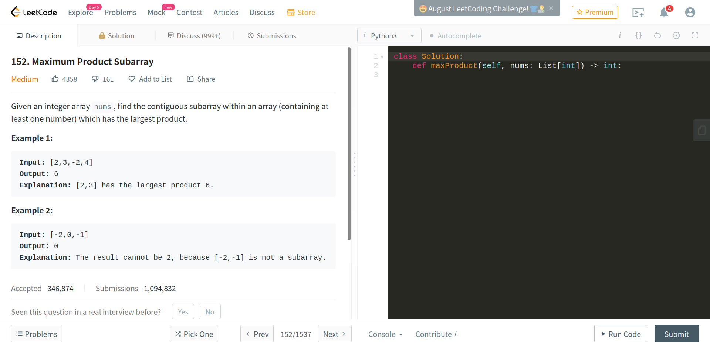
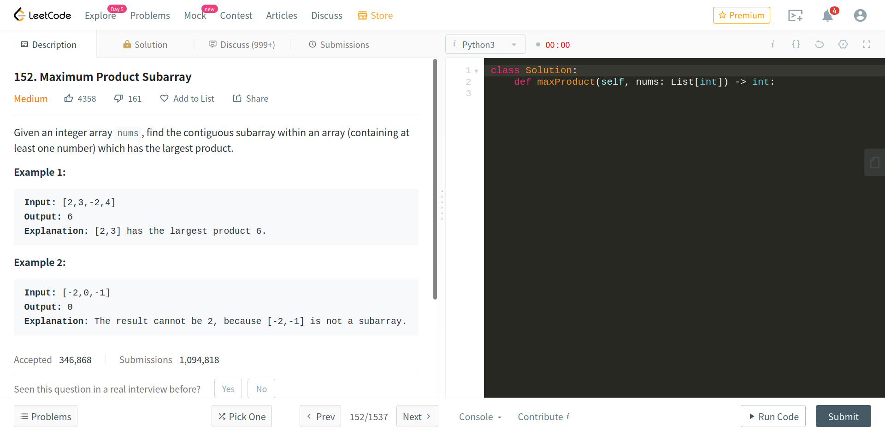

# leetcode timer

## Overview

Add timer to leetcode using this extension

Before:</img>
After:</img>

It replaces the "autocomplete" button text with timer. Just changes the span element's inner html so the button is still functional.

## Installing temporay add-ons

### Chrome

Go to [extensions](chrome://extensions).  
Turn on developer mode  
Select **Load Unpacked**  
Select the downloaded folder  

### Firefox

Go to [debugging](about:debugging) 
Click on **This Firefox** then **Load Temporary Add-on**  
Select *manifest.json* file in the downloaded folder  

Load a problem **You might need to reload the webpage to rerun the script when changing questions**